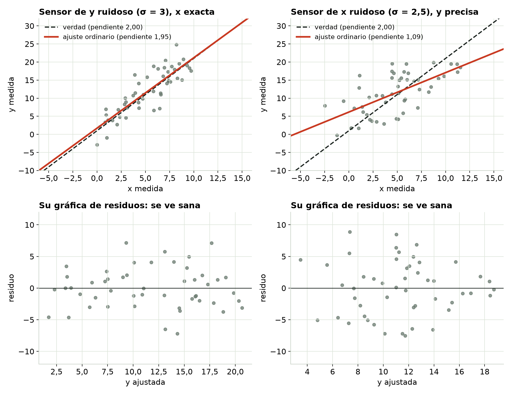
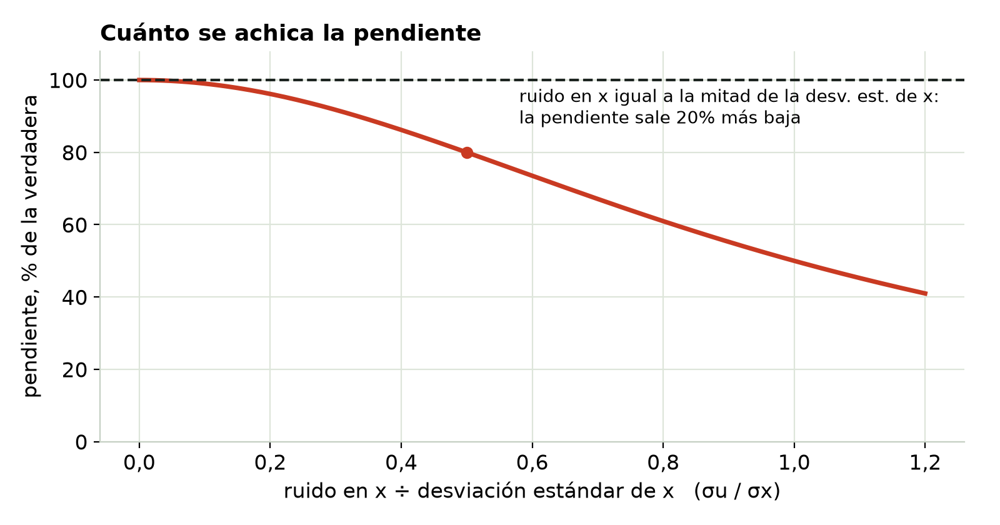
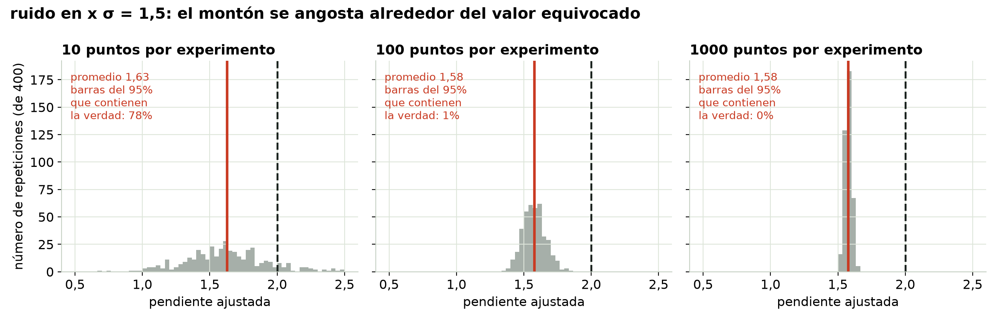
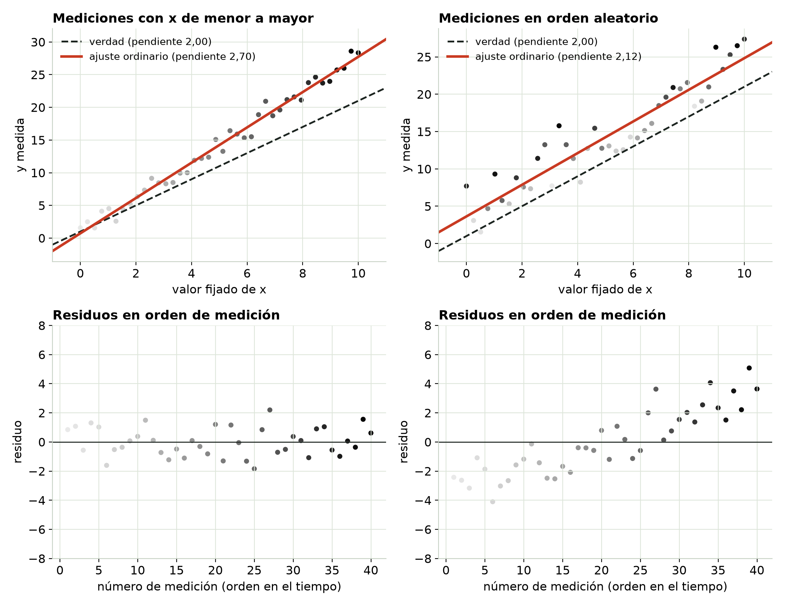
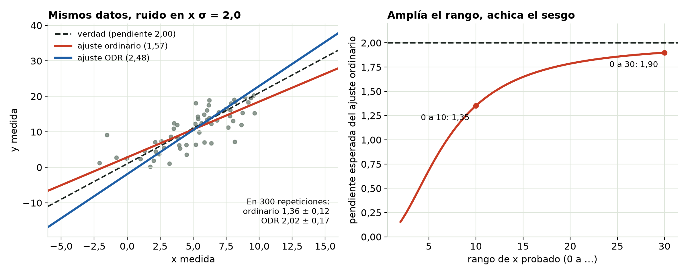

## Primero, predice {.center}

Ajustas una recta a datos de laboratorio. Después, uno de los sensores se vuelve más ruidoso.

::: {.incremental}
- Si el sensor de **y** se vuelve más ruidoso, ¿la pendiente ajustada se vuelve más empinada, más plana o queda igual?
- ¿Y si el que se vuelve más ruidoso es el sensor de **x**?
:::

::: notes
Pide que levanten la mano para cada una antes de seguir. La mayoría dice "las dos quedan igual, solo más desordenadas". Solo la primera es correcta.
:::

## El ruido en y cuesta precisión. El ruido en x cuesta exactitud.

{fig-align="center" height="560"}

::: notes
Columna izquierda: el ruido en y se triplica, la nube engorda, y el ajuste rojo sigue cayendo sobre la verdad discontinua. Columna derecha: ruido en x, y la recta roja se ve claramente más plana. Señala la fila de abajo: las dos gráficas de residuos parecen una banda sana y pareja. La de la derecha no da ningún aviso.
:::

## Por qué la gráfica de residuos no puede avisarte

- Un ajuste por mínimos cuadrados se inclina hasta que los residuos quedan **equilibrados respecto de x**.
- Así que cualquier error que esté enredado con x se absorbe en la pendiente, en vez de quedarse en los residuos.
- Una gráfica de residuos solo puede mostrar lo que el ajuste **no** absorbió.

::: {.callout}
Este problema se descubre preguntándose cómo se produjeron los datos, no mirando lo que sobra.
:::

::: notes
La versión matemática: mínimos cuadrados ordinarios obliga a que los residuos tengan correlación cero con x en cada muestra. Así que una gráfica de residuos contra x nunca puede mostrar una correlación entre el error y x, aunque el error verdadero sí la tenga.
:::

## ¿Cuánto se achica la pendiente?

{fig-align="center" height="440"}

**Regla práctica:** compara el error del sensor de x con la **desviación estándar** de tus x (unos 2,9 si x va pareja entre 0 y 10; no el rango de 10). Con un cociente de 0,3 la pendiente sale más o menos un 8% baja; con 0,5, un 20%; con 1, la mitad.

::: notes
La pendiente ajustada sale en σx² / (σx² + σu²) de la verdadera, donde σx es la desviación estándar de los valores verdaderos de x y σu el ruido del sensor de x. Los estadísticos llaman a ese cociente el cociente de confiabilidad. Esto es para valores de x que lees en un instrumento. Si fijas x con una perilla y anotas el valor fijado, el error es de otro tipo (error de Berkson) y no sesga la pendiente.
:::

## ¿Lo arreglan más datos? No.

{fig-align="center" width="100%"}

El montón se angosta alrededor de **1,58**, no de 2,00. Con 1000 puntos, las barras de error del 95% del software nunca contienen la verdad.

::: notes
Cada panel repite el experimento completo 400 veces. Esta es la diferencia entre una estimación sesgada y una ruidosa: el ruido se promedia; el sesgo, no.
:::

## Algo que no mediste

{fig-align="center" height="520"}

::: notes
Algo deriva durante la sesión (la temperatura del cuarto, una batería, el calentamiento del equipo) y empuja a y. Izquierda: si barres x de menor a mayor, la deriva viaja junto con x e infla la pendiente a 2,70 en esta muestra (alrededor de 2,6 en promedio), y los residuos en orden de medición parecen ruido. Derecha: si aleatorizas el orden, la pendiente vuelve a estar cerca de 2 en promedio (cada muestra igual se dispersa alrededor de ese valor), y la deriva aparece claramente como una tendencia en la gráfica en orden de medición.
:::

## Aleatoriza el orden de medición

- Barrer x de menor → mayor ata **cualquier cosa que cambie con el tiempo** a x.
- Aleatorizar no elimina la deriva. La vuelve **inofensiva** (no entra en la pendiente) y **visible** (una tendencia en el orden de medición).
- Registra también lo que pueda derivar: la temperatura ambiente, el voltaje de la fuente, el tiempo desde que se encendió el equipo.

## Lo que de verdad corrige el ruido en x

{fig-align="center" width="100%"}

- **Ajuste con errores en x** (distancia ortogonal / Deming): elimina el sesgo, pero necesita el nivel de ruido de cada sensor y varía más.
- **Prueba en un rango más amplio:** el mismo ruido importa menos cuando x varía más.

::: notes
La recta ODR de una sola muestra, a la izquierda, se pasa; esa es la variación extra. El recuadro muestra el promedio en 300 repeticiones: ordinario 1,36, ODR 2,02. En Python está en scipy.odr; el script que acompaña al módulo tiene el código.
:::

## Pruébalo tú

```{=html}
<iframe data-src="index.html#trial1" width="100%" height="520" style="border:1px solid #c5d0c3;border-radius:4px;" title="Interactivo de El sesgo invisible"></iframe>
```

El interactivo viene de la página del módulo. [Ábrelo en otra pestaña](index.html){target="_blank"}.

## Tres preguntas para cualquier ajuste

::: {.columns}
::: {.column width="33%"}
### ¿De verdad x es exacta?
Compara el error del sensor de x con la desviación estándar de tus valores de x. ¿Pasa de más o menos un tercio de eso? Espera una pendiente un 10% o más demasiado plana.
:::
::: {.column width="33%"}
### ¿Qué cambió durante la sesión?
La temperatura, el voltaje de la fuente, el calentamiento, el desgaste. Si se mueve junto con x, se esconde dentro de tu pendiente.
:::
::: {.column width="33%"}
### ¿La y influye en la x?
En las pruebas de lazo cerrado, un controlador fija x a partir de y, así que las dos quedan enredadas por diseño.
:::
:::

## El nombre de esto

**Endogeneidad:** el error en y está relacionado con x. La pendiente está mal, más datos no ayudan y la gráfica de residuos lo esconde.

La **heterocedasticidad** es otro problema: dispersión desigual. **Sí** se ve en la gráfica de residuos (una forma de abanico), y la pendiente sigue siendo correcta; solo las barras de error están mal.

::: {.callout}
La dispersión desigual tiene su propio módulo (el Módulo 3). Sigue: el Módulo 6, cómo usar y reportar un ajuste.
:::
