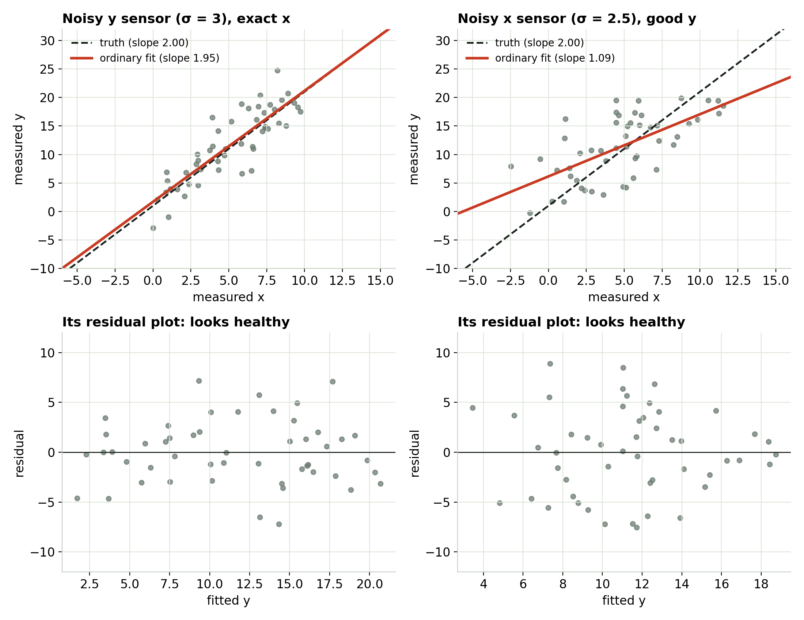
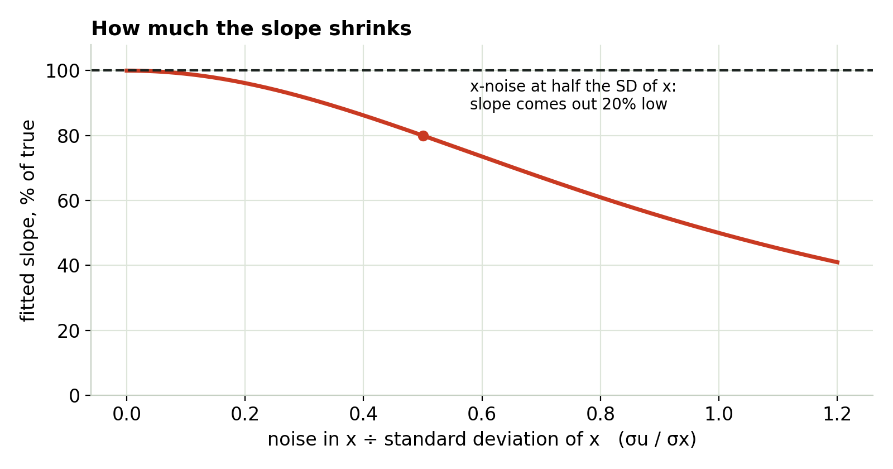
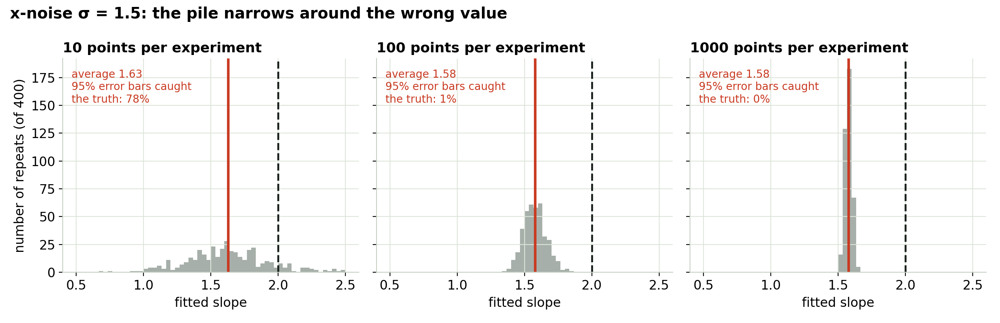
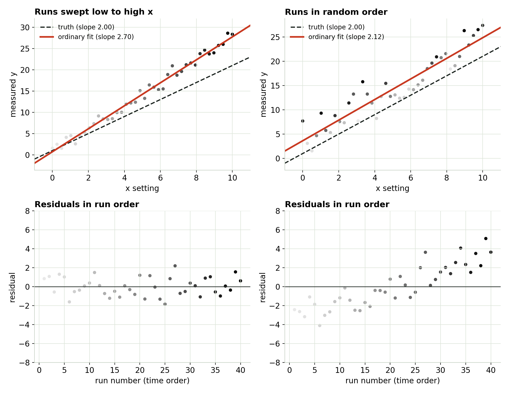
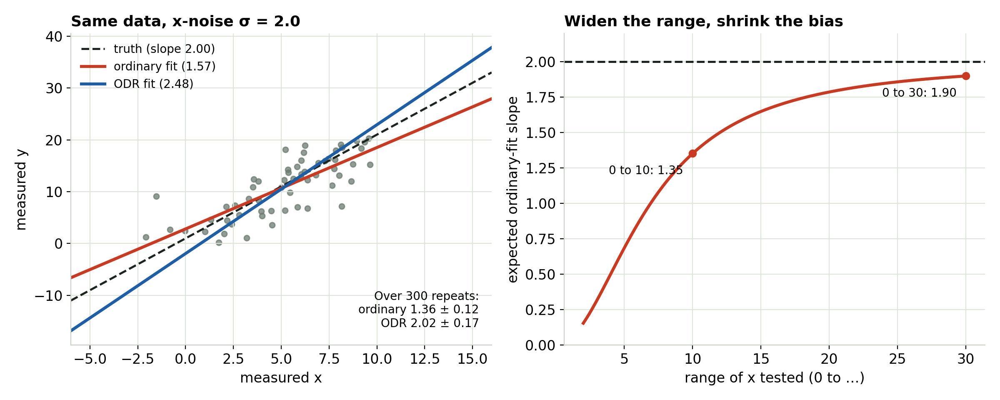

## Predict first {.center}

You fit a straight line to lab data. Then one sensor gets noisier.

::: {.incremental}
- If the **y** sensor gets noisier, the fitted slope will… get steeper? flatter? stay the same?
- If the **x** sensor gets noisier, the fitted slope will… ?
:::

::: notes
Take a show of hands for each before moving on. Most people say "both stay the same, just messier." Only the first is right.
:::

## Noise in y costs precision. Noise in x costs accuracy.

{fig-align="center" height="560"}

::: notes
Left column: y noise triples, the cloud gets fat, the red fit still lands on the dashed truth. Right column: x noise, the red line is visibly flatter. Point at the bottom row: both residual plots look like a healthy, even band. The one on the right gives no warning.
:::

## Why the residual plot can't warn you

- A least-squares fit tilts itself until the leftovers are **balanced against x**.
- So whatever error is tangled up with x gets absorbed into the slope, not left in the residuals.
- A residual plot can only show what the fit **didn't** absorb.

::: {.callout}
You catch this problem by asking how the data was produced, not by looking at the leftovers.
:::

::: notes
The math version: OLS forces the residuals to have zero correlation with x in every sample. So a residual-vs-x plot can never show a correlation between the error and x, even when the true error has one.
:::

## How much does the slope shrink?

{fig-align="center" height="440"}

**Rule of thumb:** compare the x sensor's error with the **standard deviation** of your x values (about 2.9 for x spread evenly over 0 to 10, not the range of 10). At a ratio of 0.3 the slope is about 8% low; at 0.5, 20% low; at 1, half.

::: notes
The fitted slope comes out at SD² / (SD² + noise²) of the truth, where SD is the standard deviation of the true x values. Statisticians call that ratio the reliability ratio. This is for x values you read off an instrument. If you set x on a dial and record the setting, the error is a different kind (Berkson error) and it does not bias the slope.
:::

## Will more data fix it? No.

{fig-align="center" width="100%"}

The pile gets narrower around **1.58**, not 2.00. At 1000 points the software's 95% error bars never contain the truth.

::: notes
Each panel repeats the whole experiment 400 times. This is the difference between a biased estimate and a noisy one: noise averages out, bias doesn't.
:::

## Something you didn't measure

{fig-align="center" height="520"}

::: notes
Something drifts during the session (room temperature, battery, warm-up) and nudges y. Left: sweep x low to high, the drift rides along with x and inflates the slope to 2.70 in this sample (about 2.6 on average), and the run-order residuals look like noise. Right: randomize the order, the slope comes back near 2 on average (any one sample still scatters around it), and the drift shows up plainly as a trend in the run-order plot.
:::

## Randomize the run order

- Sweeping x low → high ties **anything that changes with time** to x.
- Randomizing doesn't remove drift. It makes it **harmless** (not in the slope) and **visible** (a trend in run order).
- Also log what might drift: ambient temperature, supply voltage, time since power-on.

## What actually fixes noise in x

{fig-align="center" width="100%"}

- **Errors-in-x fit** (orthogonal distance / Deming): removes the bias, but needs each sensor's noise level and wobbles more.
- **Test over a wider range:** the same noise matters less when x varies more.

::: notes
The single-sample ODR line on the left overshoots; that's the extra wobble. The box shows the average over 300 repeats: ordinary 1.36, ODR 2.02. In Python it's scipy.odr; the companion script has the code.
:::

## Try it yourself

```{=html}
<iframe data-src="index.html#trial1" width="100%" height="520" style="border:1px solid #c5d0c3;border-radius:4px;" title="The Invisible Bias interactive"></iframe>
```

The interactive loads from the page next to these slides. [Open it in its own tab](index.html){target="_blank"}.

## Three questions to ask about any fit

::: {.columns}
::: {.column width="33%"}
### Is x really exact?
Compare the x sensor's error with the standard deviation of your x values. More than about a third of it? Expect the slope 10% or more too flat.
:::
::: {.column width="33%"}
### What changed during the session?
Temperature, supply voltage, warm-up, wear. If it moves with x, it hides inside your slope.
:::
::: {.column width="33%"}
### Does y push back on x?
In closed-loop tests a controller sets x from y, so they're tangled by design.
:::
:::

## The name for this

**Endogeneity:** the error in y is related to x. The slope is wrong, more data doesn't help, and the residual plot hides it.

**Heteroskedasticity** is a different problem: uneven scatter. It **does** show in the residual plot (a fan shape), and the slope stays right; only the error bars are off.

::: {.callout}
Uneven scatter has its own module (Module 3). Next: Module 6, using and reporting a fit.
:::
