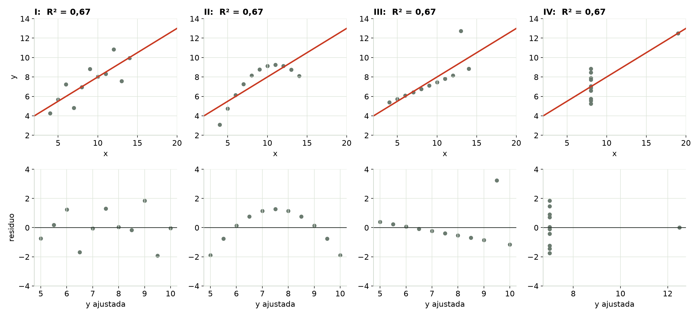
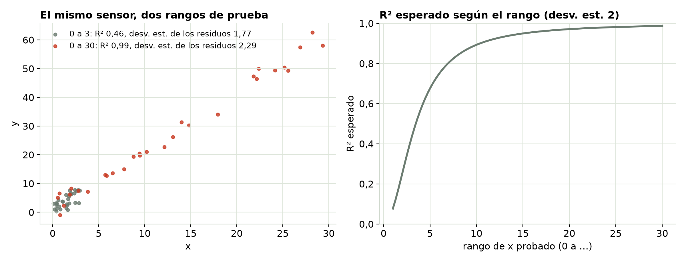
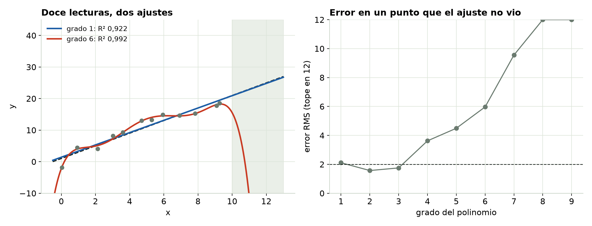

## Primero, predice {.center}

Cuatro conjuntos de datos. La misma pendiente, la misma ordenada al origen, el mismo R² = 0,67.

::: {.incremental}
- ¿Qué tan distintos pueden verse?
:::

## Cuatro conjuntos de datos, un solo R²

{fig-align="center" width="100%"}

::: notes
El cuarteto de Anscombe (1973). I: una recta con dispersión. II: una curva suave. III: una recta perfecta con un punto malo. IV: ninguna tendencia; un solo punto fija la pendiente. Fila de abajo: las gráficas de residuos. Distinguen los cuatro al instante; R² no puede.
:::

## R² no distingue un buen ajuste de uno malo

- R² = la parte de la dispersión en y que explica la recta.
- No dice nada sobre la **forma**, los **puntos sueltos** ni si una recta era el modelo correcto.
- Mira primero los datos y los residuos. El Módulo 2 muestra qué buscar.

## R² mide tu rango de prueba

{fig-align="center" width="100%"}

::: notes
El mismo sensor, el mismo ruido. Si pruebas entre 0 y 3, R² es de alrededor de 0,5; entre 0 y 30, de alrededor de 0,99. La desviación estándar de los residuos se queda cerca de 2, el ruido del sensor. R² es en parte una calificación de tu plan de pruebas.
:::

## Reporta la desviación estándar de los residuos, en unidades

- El mismo ruido, un rango más amplio → un R² más alto. Nada del sensor cambió.
- La **desviación estándar de los residuos** dice qué tan lejos de la recta suele quedar una sola lectura, en unidades reales.
- "s = 0,4 °C" significa algo. "R² = 0,998", por sí solo, no.

## Más términos siempre suben R²

{fig-align="center" width="100%"}

::: notes
Doce lecturas de una recta verdadera. Un polinomio de grado 6 tiene un R² más alto y pasa por los puntos, pero su error en un punto que no vio (dejar uno fuera, reajustar, predecir) sube a partir del grado 4 más o menos, y justo después de los datos se descontrola.
:::

## Elige el modelo a partir de la física

- Cada término extra sube R², aunque solo ajuste ruido.
- El **R² ajustado** cobra por cada término; el **error en puntos no vistos** (dejar uno fuera) muestra lo que importa: la predicción.
- Elige la forma que te da la física. Revísala con gráficas de residuos.

## Pruébalo tú

```{=html}
<iframe data-src="index.html#trial1" width="100%" height="520" style="border:1px solid #c5d0c3;border-radius:4px;" title="Interactivo de Por qué R² no basta"></iframe>
```

El interactivo viene de la página del módulo. [Ábrelo en otra pestaña](index.html){target="_blank"}.

## Para recordar

- R² no distingue un buen ajuste de uno malo. **Grafica los datos y los residuos.**
- R² crece con tu rango de prueba. **Reporta la desviación estándar de los residuos en unidades.**
- Más términos siempre suben R². **Elige el modelo a partir de la física.**

::: {.callout}
Sigue: el Módulo 2, cómo leer una gráfica de residuos.
:::
