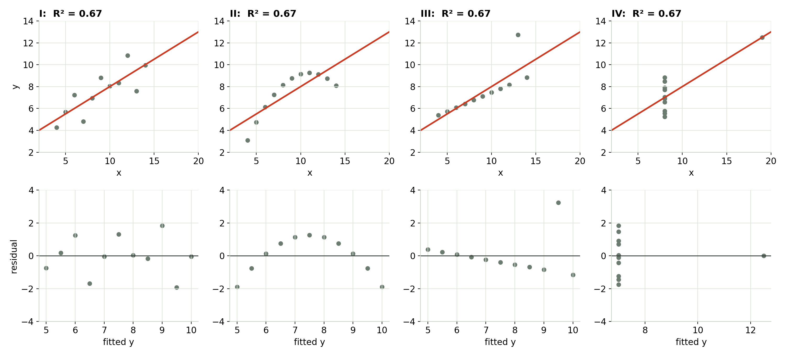
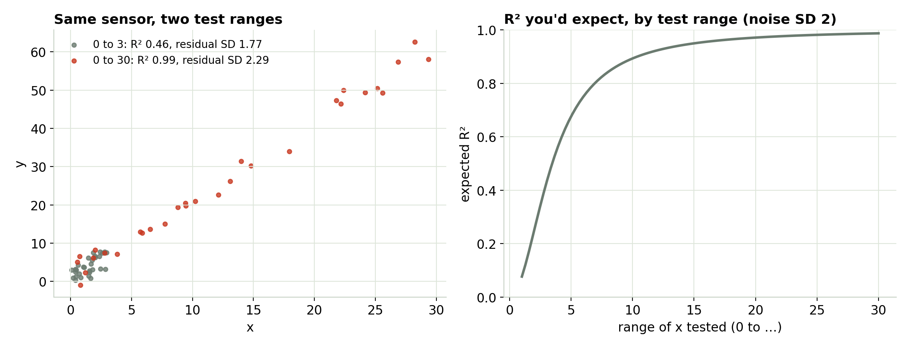
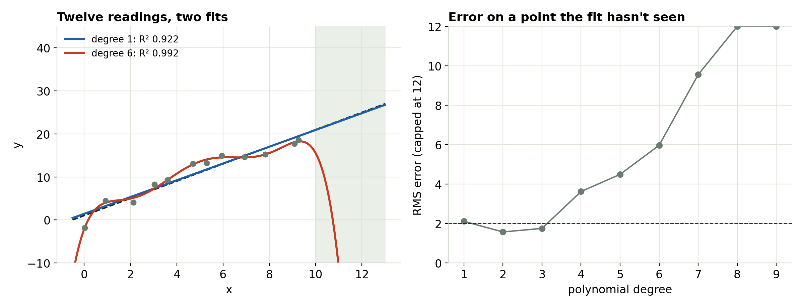

## Predict first {.center}

Four datasets. Same slope, same intercept, same R² = 0.67.

::: {.incremental}
- How different can they look?
:::

## Four datasets, one R²

{fig-align="center" width="100%"}

::: notes
Anscombe's quartet (1973). I: a line with scatter. II: a smooth curve. III: a perfect line with one bad point. IV: no trend at all, one point sets the slope. Bottom row: residual plots. They tell the four apart instantly; R² can't.
:::

## R² can't tell a good fit from a bad one

- R² = share of the scatter in y that the line accounts for.
- It says nothing about **shape**, **single points**, or whether a line was the right model at all.
- Look at the data and the residuals first. Module 2 shows what to look for.

## R² measures your test range

{fig-align="center" width="100%"}

::: notes
Same sensor, same noise. Test over 0–3 and R² is about 0.5; test over 0–30 and it's about 0.99. The residual SD stays near 2, the sensor's noise. R² is partly a grade on your test plan.
:::

## Report the residual SD, in units

- Same noise, wider range → higher R². Nothing about the sensor changed.
- The **residual SD** says how far a single reading typically sits from the line, in real units.
- "s = 0.4 °C" means something. "R² = 0.998" doesn't, on its own.

## More terms always raise R²

{fig-align="center" width="100%"}

::: notes
Twelve readings from a true straight line. A degree-6 polynomial has higher R² and threads the points, but its error on a point it hasn't seen (leave one out, refit, predict) climbs from about degree 4 on, and just past the data it goes wild.
:::

## Choose the model from the physics

- Every extra term raises R², even when it only fits noise.
- **Adjusted R²** charges for each term; **error on unseen points** (leave one out) shows what matters: prediction.
- Pick the shape the physics gives you. Check it with residual plots.

## Try it yourself

```{=html}
<iframe data-src="index.html#trial1" width="100%" height="520" style="border:1px solid #c5d0c3;border-radius:4px;" title="Why R² Isn't Enough interactive"></iframe>
```

The interactive loads from the page next to these slides. [Open it in its own tab](index.html){target="_blank"}.

## What to take away

- R² can't tell a good fit from a bad one. **Plot the data and the residuals.**
- R² grows with your test range. **Report the residual SD in units.**
- More terms always raise R². **Choose the model from the physics.**

::: {.callout}
Next: Module 2, reading a residual plot.
:::
