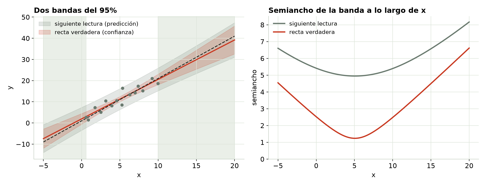
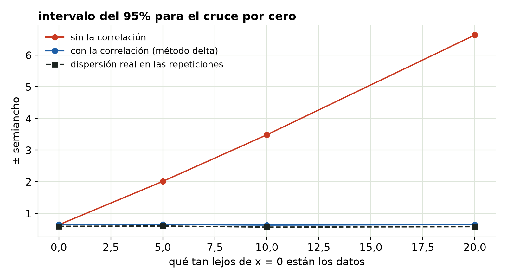

## Dos preguntas, dos bandas {.center}

- ¿Dónde está la **recta verdadera**? → banda de confianza.
- ¿Dónde caerá la **siguiente lectura**? → banda de predicción.

## Dos bandas del 95%

{fig-align="center" width="100%"}

::: notes
La banda de predicción siempre es más ancha: suma el ruido propio del sensor, que nunca se achica con más datos. Las dos se abren lejos del centro de los datos. Fuera del rango probado (sombreado) son el mejor caso: suponen que la recta sigue valiendo.
:::

## Extrapolación

- Las dos bandas crecen fuera de los datos, y esa es la versión **optimista**.
- Suponen que el modelo sigue valiendo allá afuera. Nada en los datos puede confirmarlo.
- Extrapola solo hasta donde te lo permita la física.

## Llevar la incertidumbre a un resultado

{fig-align="center" height="440"}

::: notes
Estimamos dónde la recta cruza el cero a partir de datos lejanos a x = 0. La ordenada al origen y la pendiente están correlacionadas. Ignorar eso (combinar los dos errores estándar como si fueran independientes) exagera aquí el intervalo hasta 10 veces; el método delta con la covarianza completa coincide con la dispersión real.
:::

## Usa la covarianza completa

- La pendiente y la ordenada al origen salen de los mismos puntos; cuando una sale alta, la otra sale baja.
- **Método delta:** Var(g) ≈ ∇gᵀ Σ ∇g, con la matriz de covarianza completa Σ.
- **Bootstrap:** remuestrea los puntos, reajusta y mira la dispersión. No hace falta cálculo.

## Qué dejar por escrito

```
Ajuste lineal por mínimos cuadrados, n = 15 lecturas entre x = 0,6 y 10,0.
Pendiente b1 = 1,86 ± 0,43 (95%); ordenada al origen b0 = 1,92 ± 2,52.
Desv. est. de los residuos s = 2,22 (en unidades de y).
Predicción en x = 5,0: 11,2 ± 4,9 para una sola lectura nueva (95%).
Revisión de residuos: contra el valor ajustado ___, en orden de medición ___,
puntos sueltos ___.
x medida con ___ (incertidumbre ___); orden de medición aleatorio / barrido.
```

## Pruébalo tú

```{=html}
<iframe data-src="index.html#trial1" width="100%" height="520" style="border:1px solid #c5d0c3;border-radius:4px;" title="Interactivo de Cómo usar y reportar un ajuste"></iframe>
```

El interactivo viene de la página del módulo. [Ábrelo en otra pestaña](index.html){target="_blank"}.

## La serie en seis líneas

1. R² no distingue un buen ajuste de uno malo.
2. Lee los residuos: forma, dispersión, orden en el tiempo, puntos sueltos.
3. La dispersión desigual rompe las barras de error → pondera, o usa errores robustos.
4. Los errores ligados también las rompen → modela la dinámica, cuenta corridas.
5. El ruido en x y una deriva oculta sesgan la recta misma, sin que se note → diseña el experimento.
6. Reporta la desviación estándar de los residuos, los intervalos y lo que revisaste.
