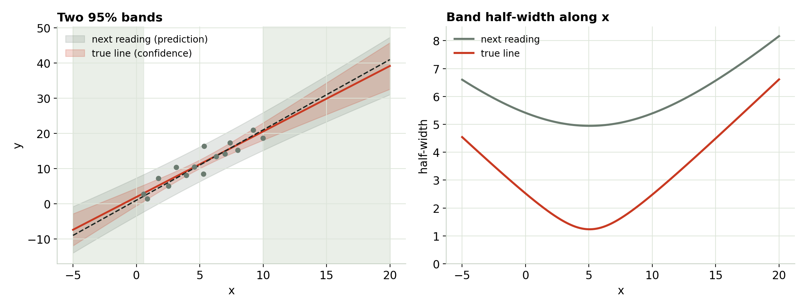
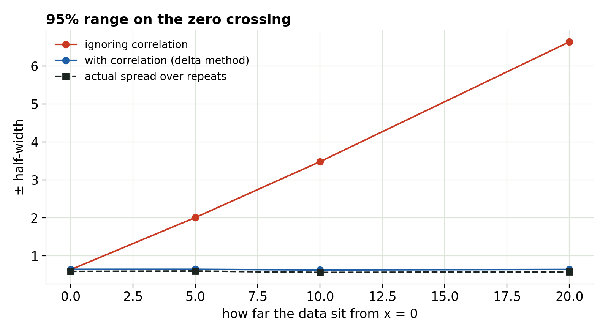

## Two questions, two bands {.center}

- Where is the **true line**? → confidence band.
- Where will the **next reading** land? → prediction band.

## Two 95% bands

{fig-align="center" width="100%"}

::: notes
The prediction band is always wider: it adds the sensor's own noise, which never shrinks with more data. Both flare away from the middle of the data. Outside the tested range (shaded) they're a best case: they assume the straight line still holds.
:::

## Extrapolation

- Both bands grow outside the data, and that's the **optimistic** version.
- They assume the model still holds out there. Nothing in the data can confirm that.
- Extrapolate only as far as the physics lets you.

## Carrying uncertainty into a result

{fig-align="center" height="440"}

::: notes
Estimating where the line crosses zero from data far from x = 0. The intercept and slope are correlated. Ignoring that (combining the two standard errors as if independent) overstates the range here by up to 10×; the delta method with the full covariance matches the actual spread.
:::

## Use the full covariance

- Slope and intercept come from the same points; when one is high the other is low.
- **Delta method:** Var(g) ≈ ∇gᵀ Σ ∇g with the full covariance matrix Σ.
- **Bootstrap:** resample the points, refit, look at the spread. No calculus needed.

## What to write down

```
Linear least-squares fit, n = 15 readings over x = 0.6 to 10.0.
Slope b1 = 1.86 ± 0.43 (95%); intercept b0 = 1.92 ± 2.52.
Residual SD s = 2.22 (in y's units).
Prediction at x = 5.0: 11.2 ± 4.9 for a single new reading (95%).
Residual checks: vs fitted ___, in run order ___, single points ___.
x measured with ___ (uncertainty ___); run order randomized / swept.
```

## Try it yourself

```{=html}
<iframe data-src="index.html#trial1" width="100%" height="520" style="border:1px solid #c5d0c3;border-radius:4px;" title="Using and Reporting a Fit interactive"></iframe>
```

The interactive loads from the page next to these slides. [Open it in its own tab](index.html){target="_blank"}.

## The series in six lines

1. R² can't tell a good fit from a bad one.
2. Read the residuals: shape, spread, time order, single points.
3. Uneven scatter breaks the error bars → weight, or robust errors.
4. Linked errors break them too → model the dynamics, count runs.
5. Noise in x and hidden drift bias the line itself, invisibly → design the experiment.
6. Report the residual SD, ranges, and what you checked.
