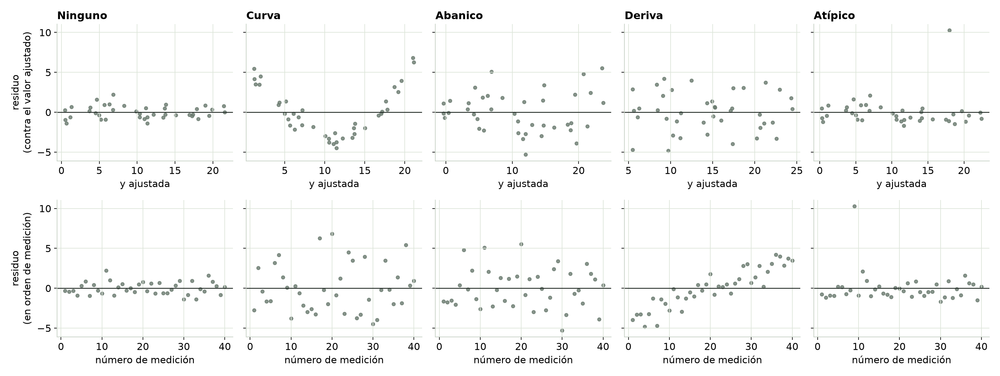
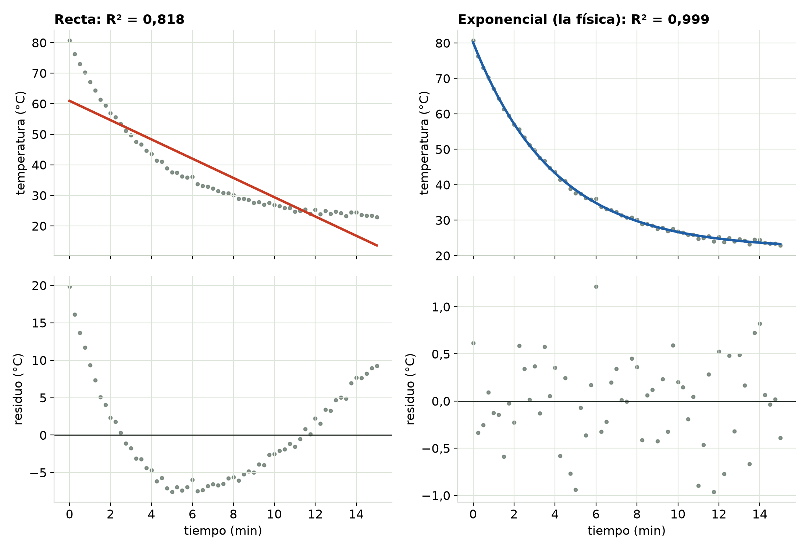
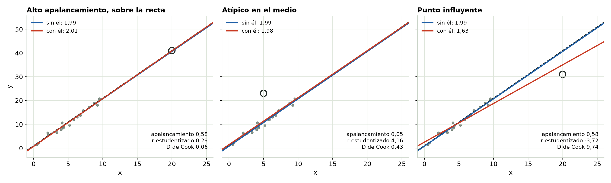

## Lo que sobra es la evidencia

- Un **residuo** es la distancia vertical entre un punto y la recta ajustada: la y medida menos la y ajustada.
- Grafícalos dos veces: contra el **valor ajustado** y en el **orden en que tomaste los datos**.
- Unos residuos sanos forman una banda plana y pareja alrededor de cero, **sin ninguna forma**.

::: notes
Pregúntale al grupo: después de ajustar una línea de tendencia en Excel, ¿qué miran? Casi siempre la respuesta es R². Este módulo trata de la gráfica que dice más.
:::

## Cuatro patrones y lo que significa cada uno

{fig-align="center" width="100%"}

Una **curvatura** = la forma está mal. Un **abanico** = dispersión desigual. Una **tendencia en el orden de medición** = algo cambió durante la sesión. **Un punto muy alejado** = revísalo.

::: notes
Fila de arriba: contra el valor ajustado. Fila de abajo: en orden de medición. Señala que la deriva (cuarta columna) casi no se ve arriba y es evidente abajo. Por eso se hacen las dos gráficas.
:::

## Haz las dos gráficas, siempre

- Contra el valor ajustado: revisa la **forma** y la **dispersión**.
- En orden de medición: revisa **cualquier cosa que haya cambiado con el tiempo**: el calentamiento del equipo, la temperatura del laboratorio, una fuente que va cayendo.
- Léelas en este orden: primero la **forma** (una forma equivocada imita a las demás), luego la dispersión, luego el orden en el tiempo y al final los puntos sueltos.

## Cuando la forma está mal

{fig-align="center" height="520"}

::: notes
Un termopar que se enfría desde 80 °C en un cuarto a 22 °C. La recta tiene R² de alrededor de 0,82 y una U clara en los residuos. La exponencial, que es lo que dice la física, deja una banda plana y da bien la constante de tiempo (alrededor de 4,0 min).
:::

## Un R² alto no significa la forma correcta

- La recta sobre la curva de enfriamiento: **R² ≈ 0,82**, con los residuos en una U clara.
- Registra solo los primeros 3 minutos: **R² ≈ 0,98**, y la U se achica a menos de 2 °C. Con un sensor ruidoso (±2 °C) queda escondida en el ruido.
- Una ventana de prueba corta puede hacer que cualquier curva suave parezca recta. Ajusta el modelo que te da la física.

## Un punto que dirige la recta

{fig-align="center" width="100%"}

::: notes
Izquierda: lejos en x pero sobre la tendencia. Le da estabilidad al ajuste. Centro: muy lejos de la recta pero dentro del rango de los datos. Casi no mueve la pendiente, aunque sube toda la recta y ensancha las barras de error; por eso su distancia de Cook igual da alerta. Derecha: lejos en x Y fuera de la recta. Arrastra la pendiente de alrededor de 2,0 a 1,6.
:::

## Apalancamiento, atípicos, influencia

- **Apalancamiento:** qué tan lejos en x está un punto. Un apalancamiento alto significa que *podría* mover la recta.
- **Atípico:** qué tan lejos de la recta está, medido de forma justa (residuo estudentizado).
- **Influencia** (distancia de Cook): cuánto cambia todo el ajuste sin él. Para mover la pendiente hacen falta las dos cosas: apalancamiento y una desviación grande.
- Primero revisa las notas de esa medición. No borres un punto solo porque le hace daño al ajuste.

## Pruébalo tú

```{=html}
<iframe data-src="index.html#trial1" width="100%" height="520" style="border:1px solid #c5d0c3;border-radius:4px;" title="Interactivo de Cómo leer una gráfica de residuos"></iframe>
```

El interactivo viene de la página del módulo. [Ábrelo en otra pestaña](index.html){target="_blank"}.

## Hazlas tú (el código está en inglés)

```
' Excel: C = fitted = SLOPE(...)*x + INTERCEPT(...), D = residual = y - C
'        scatter D vs C, then D vs row number

% MATLAB
mdl = fitlm(x, y);
plotResiduals(mdl, 'fitted');  figure; plot(mdl.Residuals.Raw, 'o');
plotDiagnostics(mdl, 'cookd')

# Python
b1, b0 = np.polyfit(x, y, 1); resid = y - (b0 + b1 * x)
plt.scatter(b0 + b1 * x, resid); plt.figure(); plt.plot(resid, "o")
```

En Excel en español: PENDIENTE (SLOPE) e INTERSECCION.EJE (INTERCEPT), con ";" entre los argumentos.

## Para recordar

- Tres revisiones después de cada ajuste: residuos **contra el valor ajustado**, residuos **en orden de medición** y **puntos sueltos**.
- Lo sano es aburrido: una banda plana y pareja, sin forma.
- Una gráfica de residuos limpia todavía no detecta el ruido en x ni una deriva no medida que se mueve junto con x. Eso es el **Módulo 5, El sesgo invisible**.

::: {.callout}
Sigue: el Módulo 3, la dispersión desigual y lo que un abanico les hace a tus barras de error.
:::
