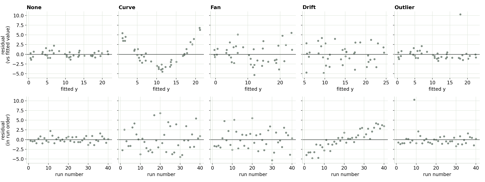
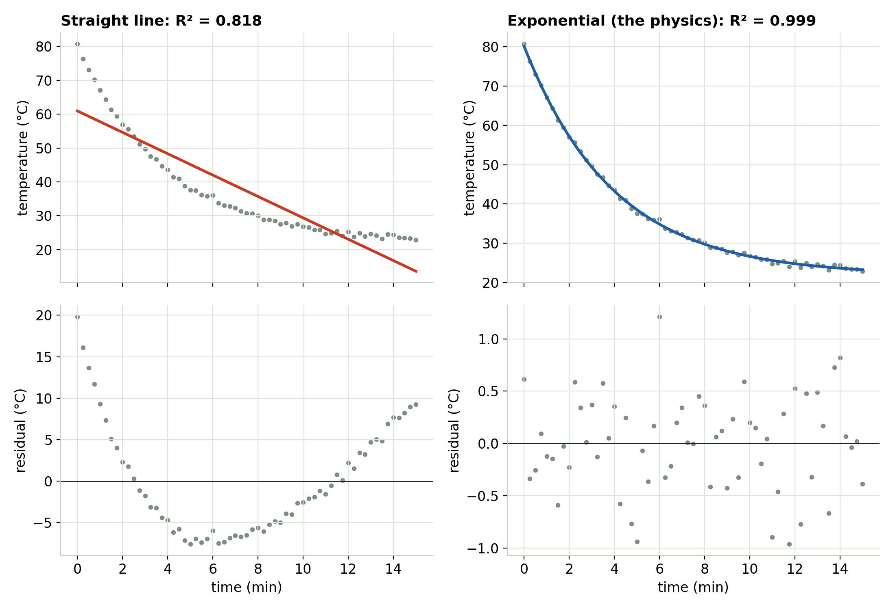
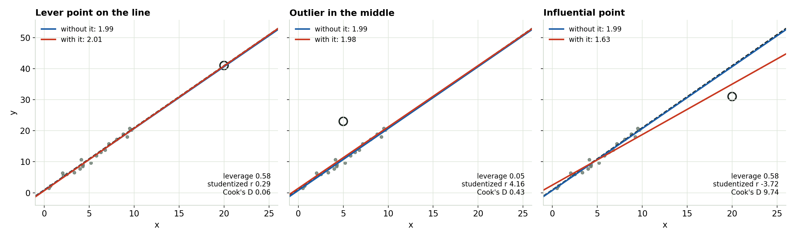

## The leftovers are the evidence

- A **residual** is the vertical gap between a point and the fitted line: measured y minus fitted y.
- Plot them twice: against the **fitted value**, and in the **order you took the data**.
- Healthy residuals are a flat, even band around zero with **no shape**.

::: notes
Ask the room: after you fit a trendline in Excel, what do you look at? Usually the answer is R². This module is about the plot that tells you more.
:::

## Four patterns, and what each one means

{fig-align="center" width="100%"}

A **bend** = wrong shape. A **fan** = uneven scatter. A **trend in run order** = something changed during the session. **One point far away** = check it.

::: notes
Top row: against the fitted value. Bottom row: in run order. Point out that drift (fourth column) is nearly invisible on top and obvious on the bottom. That's why you make both plots.
:::

## Make both plots, every time

- Against the fitted value: checks **shape** and **spread**.
- In run order: checks **anything that changed with time**: warm-up, room temperature, a sagging supply.
- Read in this order: **shape** first (a wrong shape fakes the others), then spread, then time order, then single points.

## When the shape is wrong

{fig-align="center" height="520"}

::: notes
A thermocouple cooling from 80 °C in a 22 °C room. The straight line has R² about 0.82 and a clear U in the residuals. The exponential, which is what the physics says, leaves a flat band and gets the time constant right (about 4.0 min).
:::

## A high R² doesn't mean the right shape

- The straight line on the cooling curve: **R² ≈ 0.82**, residuals in a clear U.
- Record only the first 3 minutes: **R² ≈ 0.98**, and the U shrinks to under 2 °C. With a noisy sensor (±2 °C) it hides in the noise.
- A short test window can make any smooth curve look straight. Fit the model the physics gives you.

## One point steering the line

{fig-align="center" width="100%"}

::: notes
Left: far out in x but on the trend. It steadies the fit. Middle: far off the line but within the range of the data. It barely moves the slope, though it lifts the whole line and widens the error bars; its Cook's distance is still flagged for that reason. Right: far out AND off the line. It drags the slope from about 2.0 to 1.6.
:::

## Leverage, outliers, influence

- **Leverage:** how far out in x a point sits. High leverage means it *could* move the line.
- **Outlier:** how far off the line it sits, measured fairly (studentized residual).
- **Influence** (Cook's distance): how much the whole fit changes without it. Moving the slope takes both leverage and a big miss.
- Check the notes for that run first. Don't delete a point just because it hurts the fit.

## Try it yourself

```{=html}
<iframe data-src="index.html#trial1" width="100%" height="520" style="border:1px solid #c5d0c3;border-radius:4px;" title="Reading a Residual Plot interactive"></iframe>
```

The interactive loads from the page next to these slides. [Open it in its own tab](index.html){target="_blank"}.

## Make them yourself

```
' Excel: C = fitted = SLOPE(...)*x + INTERCEPT(...), D = residual = y - C
'        scatter D vs C, then D vs row number

% MATLAB
mdl = fitlm(x, y);
plotResiduals(mdl, 'fitted');  figure; plot(mdl.Residuals.Raw, 'o');
plotDiagnostics(mdl, 'cookd')

# Python
b1, b0 = np.polyfit(x, y, 1); resid = y - (b0 + b1 * x)
plt.scatter(b0 + b1 * x, resid); plt.figure(); plt.plot(resid, "o")
```

## What to take away

- Three checks after every fit: residuals **vs fitted**, residuals **in run order**, and **single points**.
- Healthy is boring: a flat, even band with no shape.
- A clean residual plot still can't catch noise in x or unmeasured drift that moves with x. That's **Module 5, The Invisible Bias**.

::: {.callout}
Next: Module 3, uneven scatter, and what a fan does to your error bars.
:::
