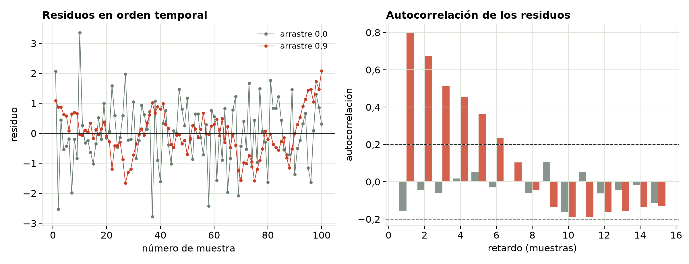
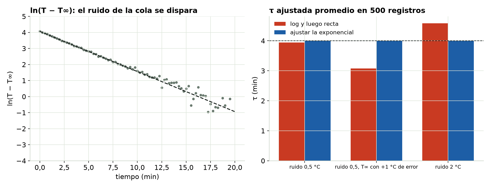
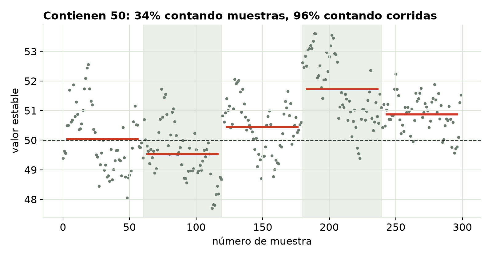

## Mil muestras ≠ mil datos independientes

- El registro rápido, los filtros y las dinámicas lentas atan cada lectura a la anterior.
- Los residuos vienen en **rachas** en vez de dispersarse de forma independiente.
- El software no lo sabe: cuenta cada muestra como evidencia nueva.

## Rachas en los residuos

{fig-align="center" width="100%"}

::: notes
Gris: errores independientes. Rojo: cada error arrastra el 90% del anterior. Izquierda: rachas largas por encima y por debajo de cero. Derecha: la autocorrelación sigue alta durante muchos retardos. Con un arrastre de 0,9, el intervalo del 95% de la pendiente contiene la verdad solo alrededor del 35% de las veces.
:::

## Qué revisar y qué hacer

- Grafica los residuos **en orden de medición**. Revisa la autocorrelación con retardo 1 o **Durbin–Watson** (≈ 2 está bien; hacia 0 está mal).
- **Primero corrige el modelo**: muchas veces la causa es un término de deriva o una constante de tiempo que falta.
- Para lo que quede: errores estándar de **Newey–West (HAC)**, o toma cada corrida completa como una unidad.

## La trampa del logaritmo en la curva de enfriamiento

{fig-align="center" width="100%"}

::: notes
Izquierda: después de sacar ln(T − T∞), los últimos puntos se dispersan muchísimo, porque 0,5 °C de ruido es enorme cuando T está 0,5 °C por encima del ambiente. Derecha: τ promedio en 500 registros. El método del logaritmo se sesga por errores en T∞ (3,1 min con T∞ desviada 1 °C) y por el ruido (4,6 min con 2 °C de ruido). Ajustar la exponencial directamente se queda en 4,0.
:::

## Ajusta la exponencial directamente

- El logaritmo estira el ruido de la cola y descarta los puntos por debajo de T∞.
- Cualquier error en T∞ dobla el final de la cola y sesga τ.
- Usa `curve_fit` (Python), `fitnlm` (MATLAB) o Solver (Excel) sobre T misma. Lo mismo para el amortiguamiento: ajusta la senoide amortiguada, no te apoyes en un solo decremento logarítmico.

## Cuenta corridas, no muestras

{fig-align="center" height="440"}

::: notes
Cinco corridas de 60 muestras; cada corrida se estabiliza un poco distinto. Tratar las 300 muestras como independientes da un intervalo del 95% que contiene el valor verdadero más o menos una de cada tres veces. Tratar cada corrida como un solo dato da un intervalo honesto.
:::

## Pruébalo tú

```{=html}
<iframe data-src="index.html#trial1" width="100%" height="520" style="border:1px solid #c5d0c3;border-radius:4px;" title="Interactivo de Datos ordenados en el tiempo"></iframe>
```

El interactivo viene de la página del módulo. [Ábrelo en otra pestaña](index.html){target="_blank"}.

## Para recordar

- **Grafica los residuos en orden temporal.** Las rachas indican errores ligados y barras de error demasiado angostas.
- **No linealices un decaimiento con logaritmos.** Ajusta la exponencial.
- **Cuenta corridas, no muestras**, cuando las corridas difieren. Más corridas achican el intervalo; más muestras por corrida, no.

::: {.callout}
Sigue: el Módulo 5, el sesgo invisible.
:::
