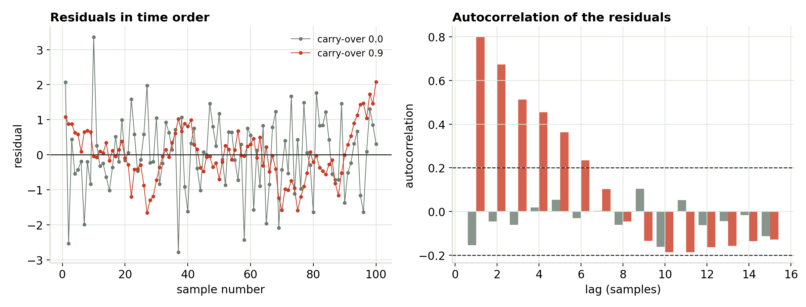
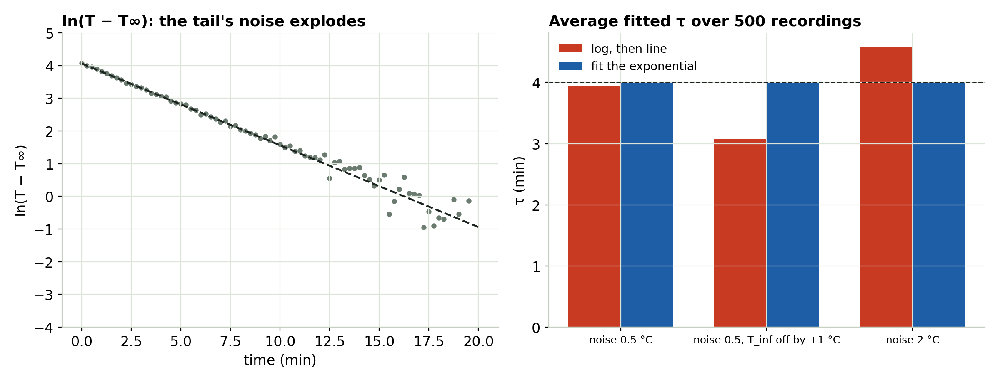
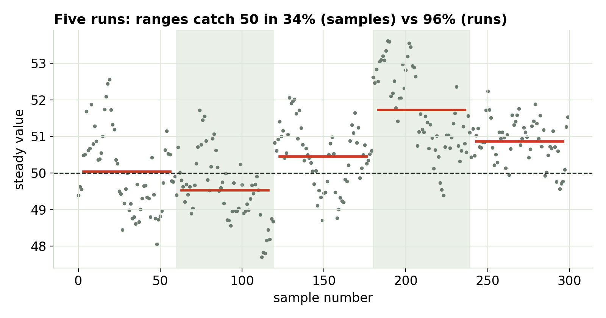

## A thousand samples ≠ a thousand pieces of evidence

- Fast logging, filters and slow dynamics link each reading to the one before.
- The residuals come in **runs** instead of scattering independently.
- The software doesn't know; it counts every sample as fresh evidence.

## Runs in the residuals

{fig-align="center" width="100%"}

::: notes
Grey: independent errors. Red: each error carries 90% of the previous one. Left: long runs above and below zero. Right: autocorrelation stays high for many lags. With carry-over 0.9 the slope's 95% range catches the truth only about 35% of the time.
:::

## What to check, and what to do

- Plot residuals **in run order**. Check lag-1 autocorrelation or **Durbin–Watson** (≈ 2 is fine, toward 0 is bad).
- **Fix the model first**: a missing drift term or time constant often causes it.
- For what's left: **Newey–West (HAC)** standard errors, or treat whole runs as the units.

## The cooling-curve log trap

{fig-align="center" width="100%"}

::: notes
Left: after taking ln(T − T∞), the late points scatter wildly because 0.5 °C of noise is huge when T is 0.5 °C above room. Right: average τ over 500 recordings. The log method is biased by T∞ errors (3.1 min with T∞ off by 1 °C) and by noise (4.6 min at 2 °C noise). Fitting the exponential directly stays at 4.0.
:::

## Fit the exponential directly

- The log stretches the tail's noise and drops points below T∞.
- Any error in T∞ bends the late tail and biases τ.
- Use `curve_fit` (Python), `fitnlm` (MATLAB) or Solver (Excel) on T itself. Same for damping: fit the damped sine, don't lean on one log decrement.

## Count runs, not samples

{fig-align="center" height="440"}

::: notes
Five runs of 60 samples, each run settling a little differently. Treating all 300 samples as independent gives a 95% range that catches the true value about a third of the time. Treating each run as one data point gives an honest range.
:::

## Try it yourself

```{=html}
<iframe data-src="index.html#trial1" width="100%" height="520" style="border:1px solid #c5d0c3;border-radius:4px;" title="Time-Ordered Data interactive"></iframe>
```

The interactive loads from the page next to these slides. [Open it in its own tab](index.html){target="_blank"}.

## What to take away

- **Plot residuals in time order.** Runs mean linked errors and too-narrow error bars.
- **Don't log-linearize a decay.** Fit the exponential.
- **Count runs, not samples**, when runs differ. More runs shrink the range; more samples per run don't.

::: {.callout}
Next: Module 5, the invisible bias.
:::
