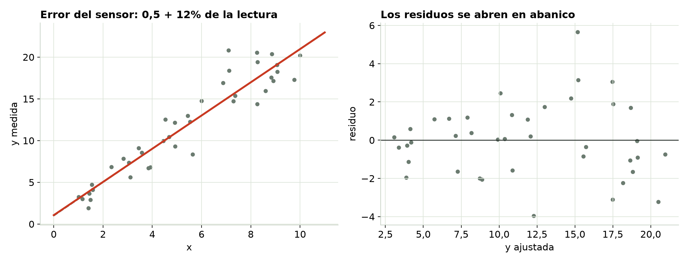
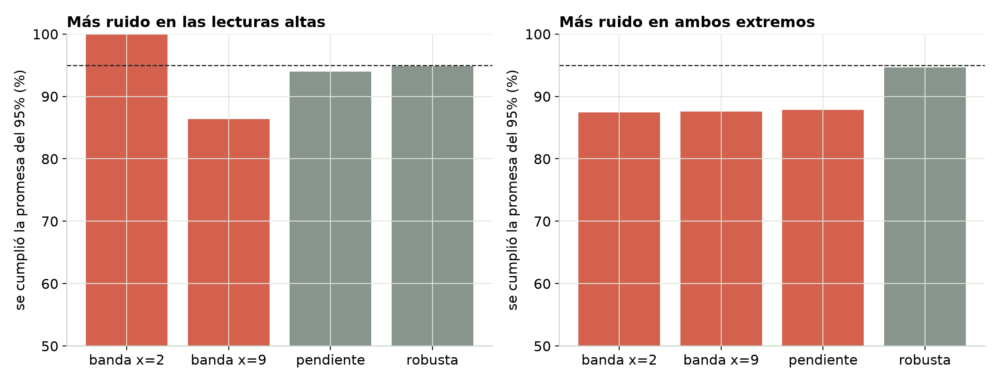
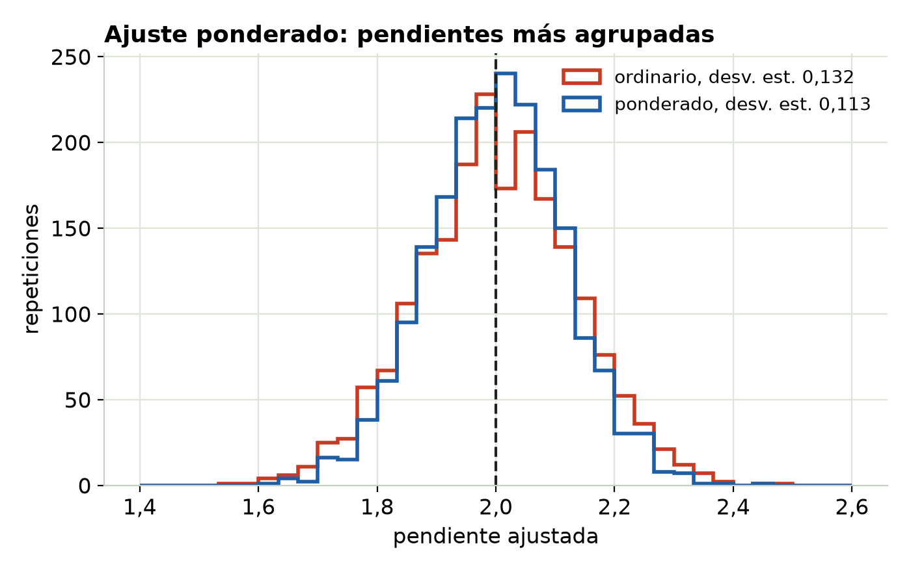

## Cuando el ruido crece con la lectura

- Muchos sensores especifican su error como "±0,5 + 10% de la lectura": las lecturas grandes traen errores grandes.
- La gráfica de residuos se **abre en abanico**. Los estadísticos lo llaman *heterocedasticidad*.
- La recta aguanta. Las barras de error, no.

## El abanico

{fig-align="center" width="100%"}

::: notes
Izquierda: el ajuste y la verdad casi coinciden. Derecha: los residuos se ensanchan a medida que crece el valor ajustado. Revisa primero la forma: una curva puede hacerse pasar por un abanico.
:::

## Las barras de error mienten

{fig-align="center" width="100%"}

::: notes
2000 repeticiones. La banda de predicción ordinaria tiene un solo ancho, así que contiene ~100% de las lecturas nuevas donde el sensor está tranquilo y ~86% donde tiene ruido. Cuando el ruido se amontona en ambos extremos, el intervalo del 95% por defecto de la pendiente también es demasiado angosto (~88%). Los errores estándar robustos HC3 se mantienen en ~95% en los dos casos.
:::

## Demasiado ancha aquí, demasiado angosta allá

- La banda ordinaria tiene el mismo ancho en todas partes; la dispersión, no.
- **Demasiado ancha** donde las lecturas son tranquilas: desperdicias precisión.
- **Demasiado angosta** donde las lecturas tienen ruido: prometes más de lo que los datos pueden cumplir.
- Los errores estándar robustos (HC3) corrigen el intervalo de la pendiente sin cambiar la recta.

## Pondera según cuánto confías en cada punto

{fig-align="center" height="440"}

Un ajuste ponderado usa w = 1/σ²: las lecturas precisas cuentan más. Su pendiente varía menos, y su banda se ensancha donde el sensor es peor.

## Las soluciones

- ¿**Conoces σ de cada lectura** (hoja de datos, lecturas repetidas)? → mínimos cuadrados ponderados, w = 1/σ².
- ¿**No conoces σ** y solo necesitas barras de error honestas? → errores estándar robustos (HC3).
- ¿Error y física **puramente multiplicativos** (ley de potencia, exponencial)? → sacar el logaritmo puede emparejar la dispersión, pero cambia lo que significan los coeficientes.
- ¿**Juntas dos instrumentos o dos sesiones**? → pondéralos o ajústalos por separado.

## Pruébalo tú

```{=html}
<iframe data-src="index.html#trial1" width="100%" height="520" style="border:1px solid #c5d0c3;border-radius:4px;" title="Interactivo de Dispersión desigual"></iframe>
```

El interactivo viene de la página del módulo. [Ábrelo en otra pestaña](index.html){target="_blank"}.

## Para recordar

- Un abanico en los residuos = dispersión desigual. **La recta está bien; las barras de error, no.**
- Pondera con **1/σ²** cuando conoces σ. Si no, usa errores estándar **robustos**.
- Revisa primero la forma: una curva puede parecer un abanico.

::: {.callout}
Sigue: el Módulo 4, datos ordenados en el tiempo.
:::
