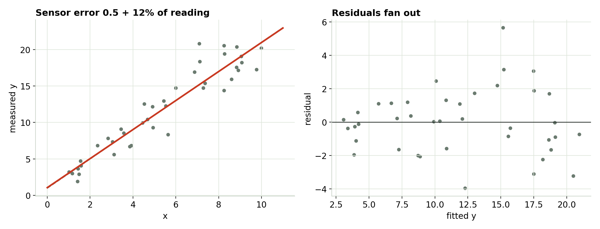
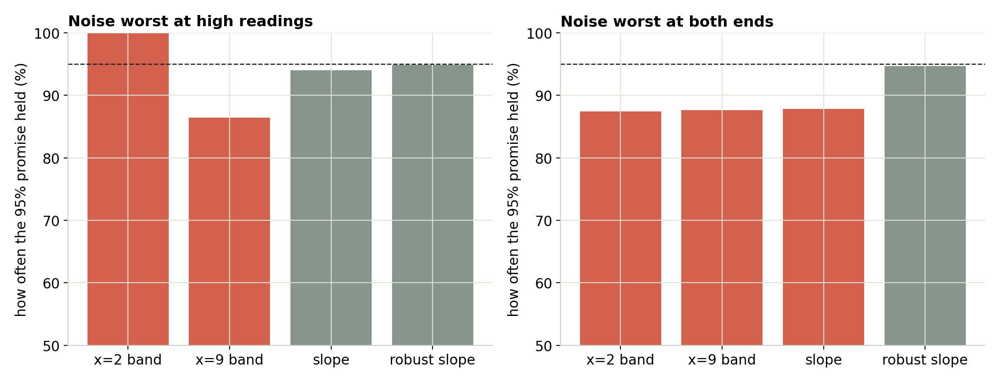
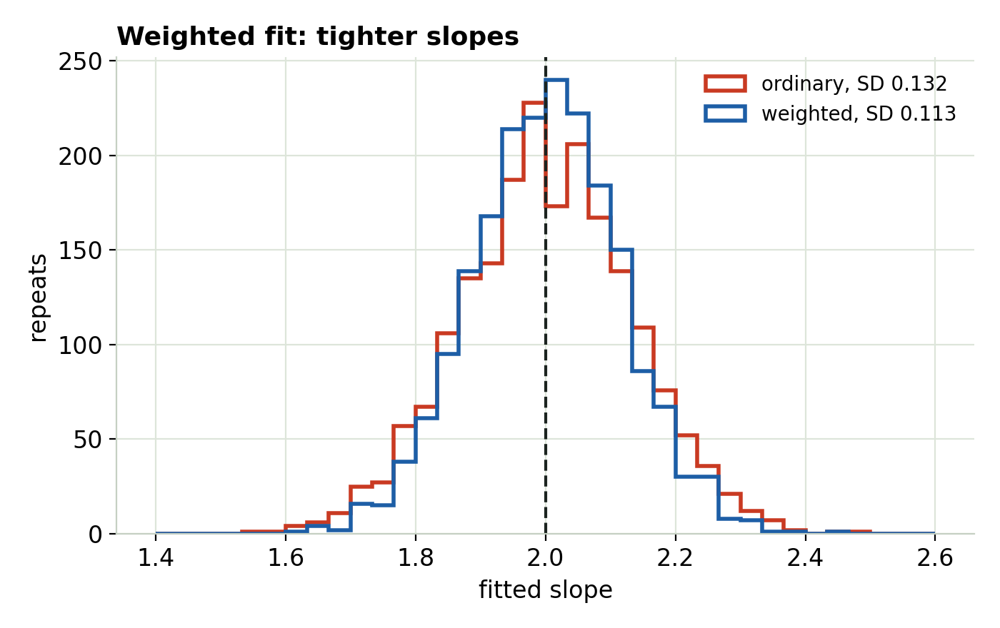

## When the noise grows with the reading

- Many sensors are rated "±0.5 + 10% of reading": big readings carry big errors.
- The residual plot **fans out**. Statisticians call it *heteroskedasticity*.
- The line survives. The error bars don't.

## The fan

{fig-align="center" width="100%"}

::: notes
Left: fit and truth nearly agree. Right: residuals widen as the fitted value grows. Check shape first: a curve can masquerade as a fan.
:::

## The error bars lie

{fig-align="center" width="100%"}

::: notes
2000 repeats. The ordinary prediction band has one width, so it catches ~100% of new readings where the sensor is quiet and ~86% where it's noisy. When the noise piles up at both ends, the slope's default 95% range is too narrow too (~88%). Robust HC3 standard errors hold ~95% in both cases.
:::

## Too wide here, too narrow there

- The ordinary band is one width everywhere; the scatter isn't.
- **Too wide** where readings are quiet: you throw away precision.
- **Too narrow** where readings are noisy: you promise more than the data can deliver.
- Robust (HC3) standard errors fix the slope's range without changing the line.

## Weight by how much you trust each point

{fig-align="center" height="440"}

A weighted fit uses w = 1/σ²: precise readings count more. Its slope scatters less, and its band widens where the sensor is worse.

## The fixes

- **Know σ for each reading** (datasheet, repeat readings)? → weighted least squares, w = 1/σ².
- **Don't know σ**, just need honest error bars? → robust (HC3) standard errors.
- **Purely multiplicative error and physics** (power law, exponential)? → a log transform can even out the scatter, but it changes what the coefficients mean.
- **Pooling two instruments or sessions**? → weight them, or fit them separately.

## Try it yourself

```{=html}
<iframe data-src="index.html#trial1" width="100%" height="520" style="border:1px solid #c5d0c3;border-radius:4px;" title="Uneven Scatter interactive"></iframe>
```

The interactive loads from the page next to these slides. [Open it in its own tab](index.html){target="_blank"}.

## What to take away

- A fan in the residuals = uneven scatter. **The line is fine; the error bars aren't.**
- Weight by **1/σ²** when you know σ. Otherwise use **robust** standard errors.
- Check the shape first: a curve can look like a fan.

::: {.callout}
Next: Module 4, time-ordered data.
:::
